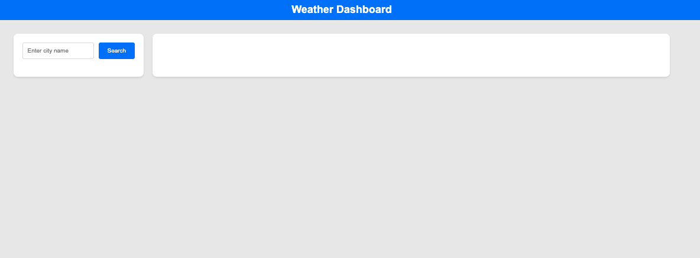

This weather app provides a user-friendly interface to display current weather conditions and a 5-day forecast for cities from your choosing. Upon loading, you are presented with a simple yet functional design where you can input the name of a city in the search bar.

When a you submit a city name, the app uses the OpenWeatherMap API to fetch and display the current weather information for that city. This includes details like temperature (in Fahrenheit, rounded to the nearest whole number for simplicity), humidity, and wind speed, along with a corresponding weather icon.

Below the current weather, the app also displays a 5-day weather forecast. This forecast shows similar data points for each day, ensuring you can plan ahead based on the expected weather conditions.

Additionally, the app maintains a search history for easy access to previously searched cities. Each city in the search history can be clicked to quickly re-fetch and display the weather data for that location.

Screenshot:

